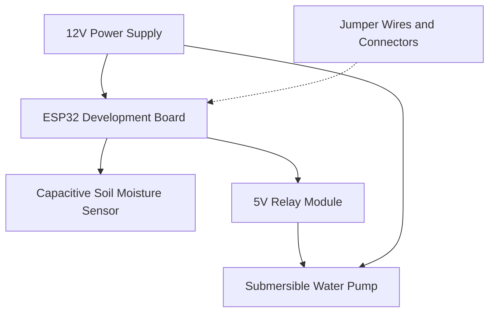
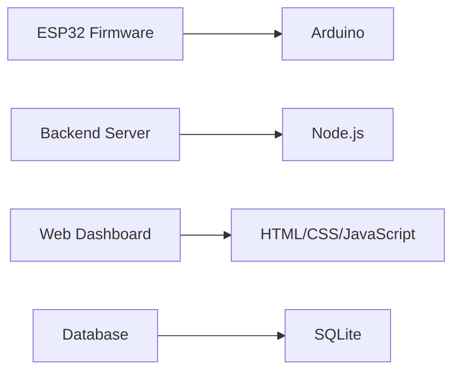

# ASEP AIDS 🌱

[](https://opensource.org/licenses/MIT)
[](https://nodejs.org/)
[](https://www.npmjs.com/)
[](https://your-documentation-url.com)

> **Automated Smart Environmental Protection - Agricultural Irrigation and Data System**


## 📋 Project Overview

ASEP AIDS is an intelligent automated irrigation system designed to optimize agricultural water usage through smart monitoring and control. The system leverages ESP32 microcontroller technology, precision moisture sensors, and automated pump control to maintain ideal soil conditions for plant growth.


## ✨ Key Features

- 📊 Real-time soil moisture monitoring
- 🚰 Automated irrigation control based on moisture thresholds
- 🌐 Web-based dashboard for remote monitoring and control
- 📈 Historical data tracking and visualization
- ⚡ Energy-efficient operation
- 📱 Mobile-responsive interface
- ⚠️ Alert system for critical conditions

## 🔧 Technical Architecture

### Hardware Components



### Software Stack



## 🛠️ Setup Instructions

### Hardware Setup

Connect components according to the following pin configuration:

```
ESP32 GPIO Configuration
├── GPIO34 (ADC) → Soil Moisture Sensor
├── GPIO26 → Relay Module
└── Power → As per specifications
```

### ESP32 Configuration

1. Install Arduino IDE
2. Add ESP32 board support:
   ```
   File → Preferences → Additional Board Manager URLs
   ```
   Add:
   ```
   https://raw.githubusercontent.com/espressif/arduino-esp32/gh-pages/package_esp32_index.json
   ```

3. Required Libraries:
   ```arduino
   #include <WiFi.h>
   #include <HTTPClient.h>
   #include <ArduinoJson.h>
   ```

4. Update WiFi credentials in `config.h`:
   ```cpp
   #define WIFI_SSID "your_ssid"
   #define WIFI_PASSWORD "your_password"
   ```

5. Flash the firmware

### Server Setup

Prerequisites:
- Node.js (v14 or higher)
- npm (v6 or higher)

Installation:
```bash
# Clone the repository
git clone https://github.com/notcaliper/asep-aids.git

# Navigate to project directory
cd asep-aids

# Install dependencies
npm install

# Setup configuration
npm run setup

# Start the server
npm start
```

## 📱 Usage Guide

### Web Interface

Access the dashboard at:
```
http://[server-ip]:3000
```


Features available:
- 📊 Real-time moisture readings
- 💧 Pump status monitoring
- 🎮 Manual override controls
- 📈 Historical data graphs
- ⚙️ System settings configuration

### Maintenance Schedule

| Task | Frequency | Description |
|------|-----------|-------------|
| Sensor Calibration | Monthly | Check and adjust sensor accuracy |
| Probe Inspection | Monthly | Physical check of moisture probes |
| Filter Cleaning | As needed | Clean water filtration system |
| Firmware Updates | As available | Update system firmware |

## ❗ Troubleshooting

<details>
<summary>System Unresponsive</summary>

- Check power connections
- Verify proper voltage levels
- Inspect for loose wires
</details>

<details>
<summary>WiFi Connectivity Issues</summary>

- Check WiFi signal strength
- Verify network credentials
- Restart ESP32 module
</details>

<details>
<summary>Incorrect Sensor Readings</summary>

- Calibrate sensors
- Clean sensor probes
- Check wiring connections
</details>

## 🤝 Contributing

We welcome contributions! Please follow these steps:

1. Fork the repository
2. Create a feature branch (`git checkout -b feature/AmazingFeature`)
3. Commit your changes (`git commit -m 'Add some AmazingFeature'`)
4. Push to the branch (`git push origin feature/AmazingFeature`)
5. Open a Pull Request

## 📄 License

This project is licensed under the MIT License - see the [LICENSE](LICENSE) file for details.

## 💬 Support

For technical support or queries:
- 🐛 Create an issue in the [GitHub repository](https://github.com/notcaliper/asep-aids/issues)

---

<div align="center">

**Last Updated:** February 9, 2025

Made with ❤️ by the AIDS E (Group 10) & NotCaliper

</div>
